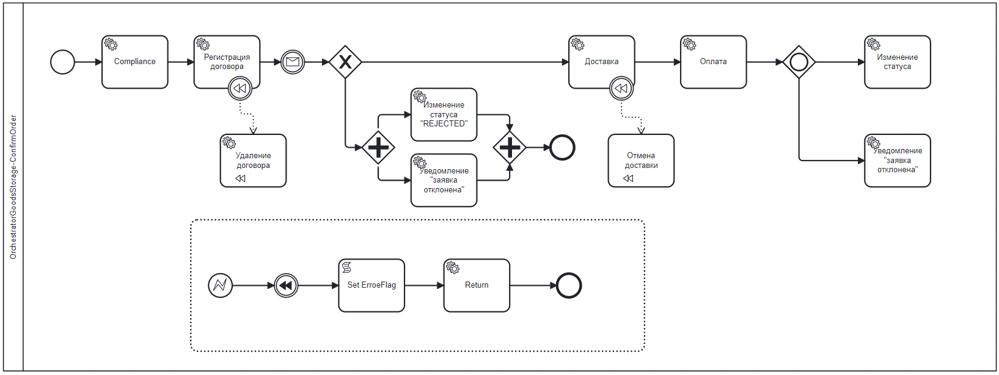

# Orchestrator Goods storage
### Описание
Данный проект создан в учебных целях, взаимодействует по REST API с основным микросервисом 
[Goods storage](https://github.com/Constantin846/java-goods-storage) для подтверждения заказов.

